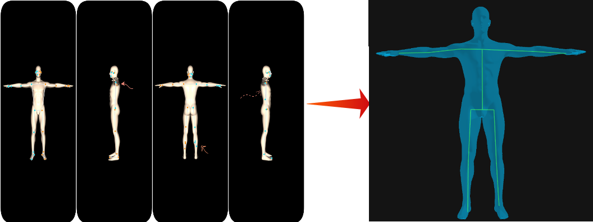

# A Mathematical Approach for Auto-Rigging 3D Models Using 2D MediaPipe




[](https://arxiv.org/)

Official code repository for the arXiv preprint: **"A Mathematical Approach for Auto-Rigging 3D Model Using 2D MediaPipe"**.

This repository contains the Python implementation of the **MAR 3D** pipeline. Unlike traditional methods that rely on probabilistic neural networks to guess 3D depth (Z-axis) from 2D images, this pipeline treats depth as a solvable geometric variable[cite: 2]. By rotating a 3D mesh in front of an orthographic camera and applying trigonometric inversion, we achieve mathematically exact, volumetrically centered skeletal structures requiring zero training data.

---

## 🔑 Key Features
*   **Semantic Jurisdiction Zones:** A strict filtering system that prevents 2D pose estimators (like MediaPipe) from hallucinating joint positions on self-occluded limbs.
*   **Decoupled Axis Projection:** Extracts true 3D depth (Z) using pure trigonometric inversion from multi-view 2D screen coordinates.
*   **Volumetric Master Engine:** Uses dynamic shoulder-width anchoring and micro-grid raycasting to perfectly center joints inside the mesh geometry.
*   **Anatomical Thickness Capping:** Prevents rays from bleeding through thin limbs (like wrists) into the torso behind them.

## 📜 License 

### This project is licensed under the [MIT License](LICENSE).
---


## ▶️ More Example: 

   
   

## ✒️Citation 
     @software{maurya2026autorigging,
      title={A Mathematical Approach for Auto-Rigging 3D Models Using 2D MediaPipe}, 
      author={Your Name and Co-authors},
      year={2026}
    }

## 🚀 Running the Pipeline


🧾Prerequisites
Make sure you have Python 3.x installed. You will need the following libraries:
```bash
#create virtual envirnoment
.
.
pip install open3d trimesh mediapipe opencv-python numpy plotly.
.
.
#Run
.
.
.
python run_voidx.py
.
.
.
# Model Requirement
.
.
.
Need 3D model named : male_t_pose.glb
.
.
.
# Result
.
.
.
debug_rig.html file showing the rigged model in plotly .
```
# 📬 Contact
For questions, collaboration, or feedback, please reach out:
Email: nanddyasty5@gmail.com

GitHub: [@KRISH9621](https://github.com/KRISH9621/3D_Autorigger_mediapipe)


